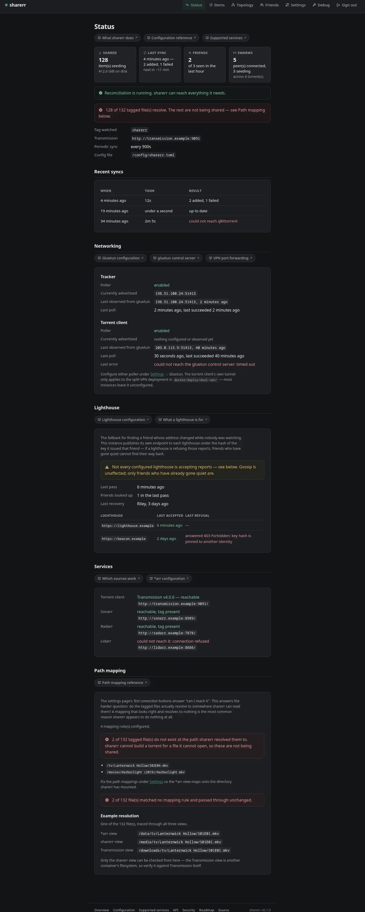
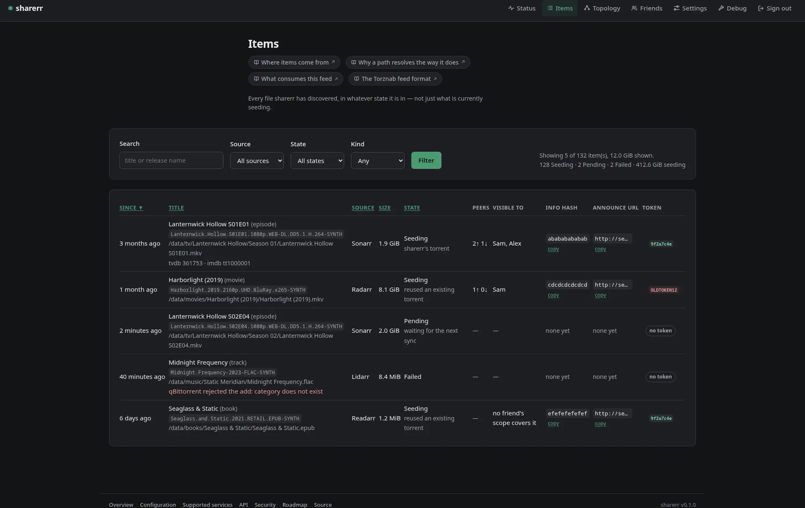
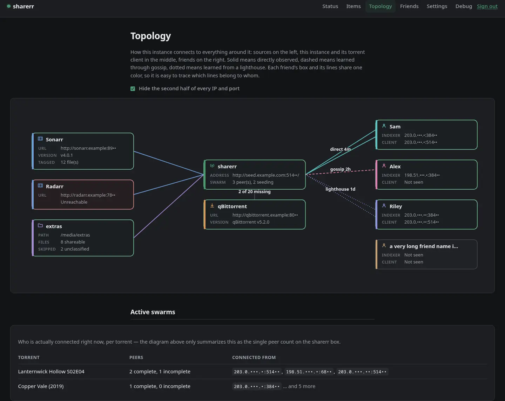
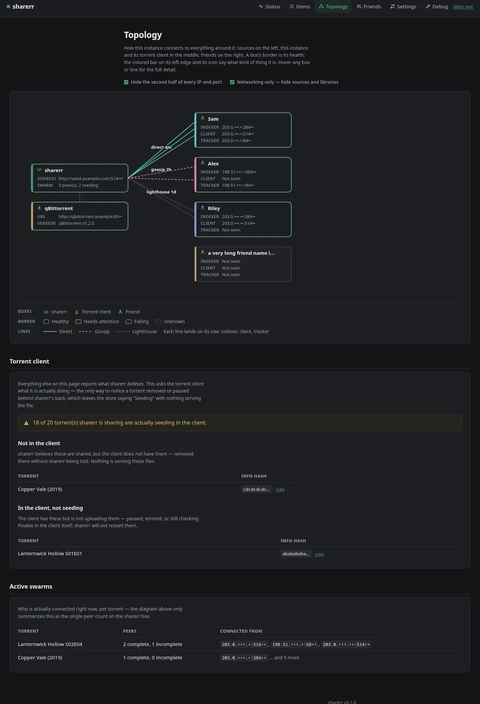
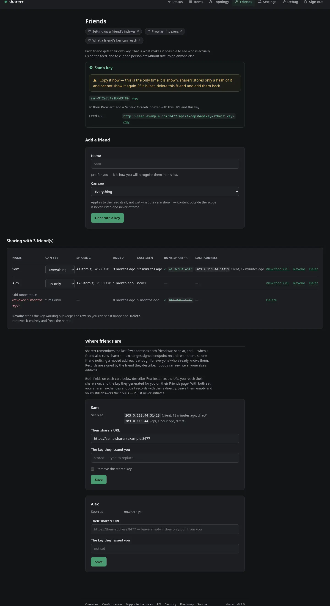
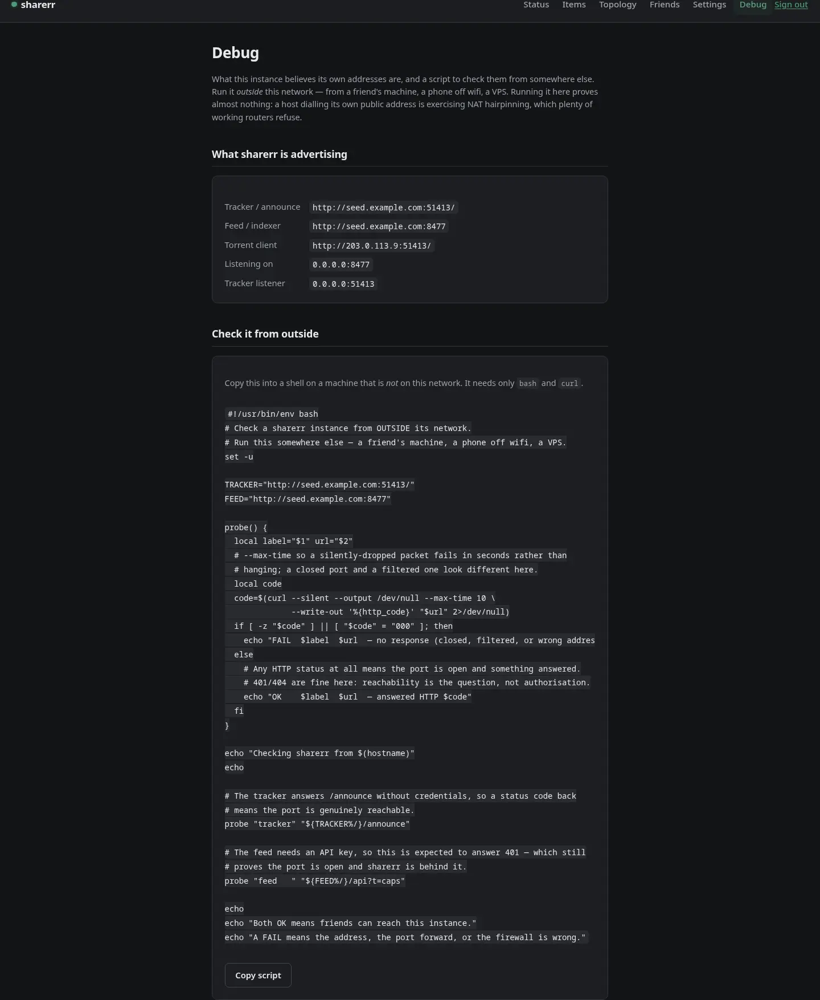
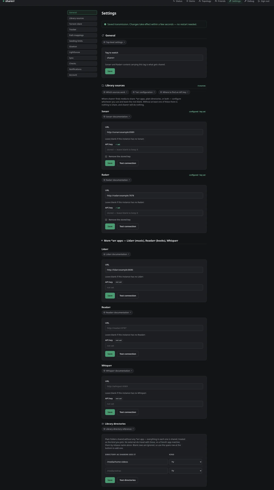
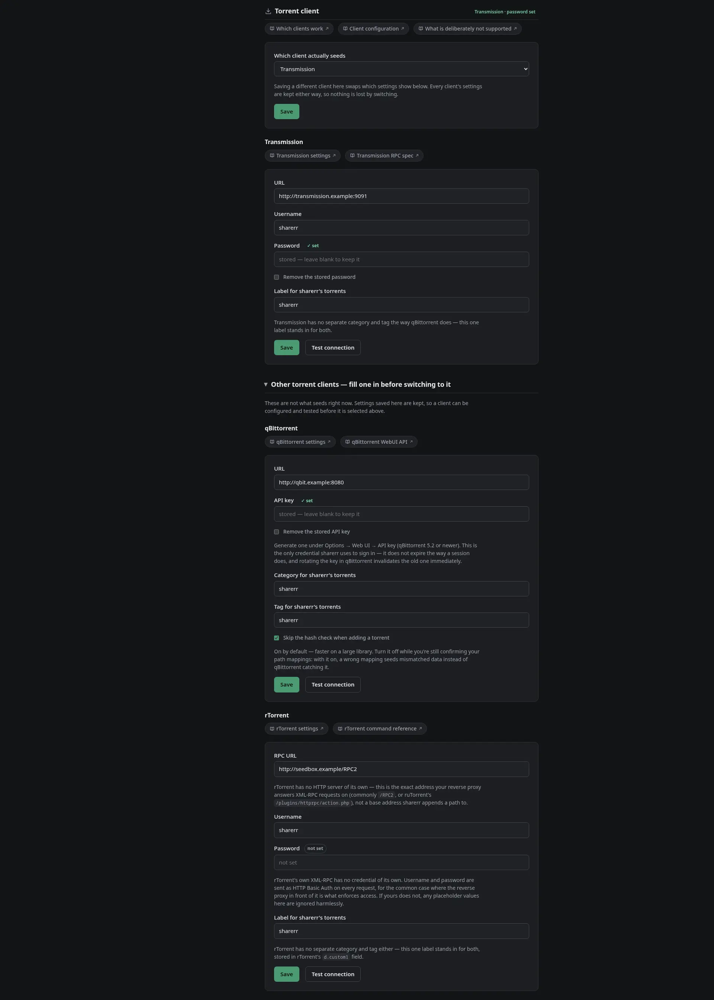
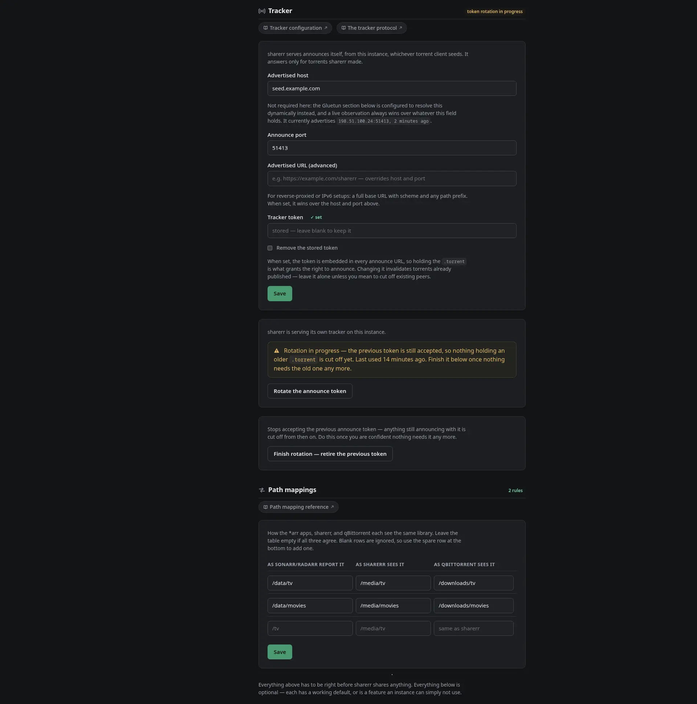
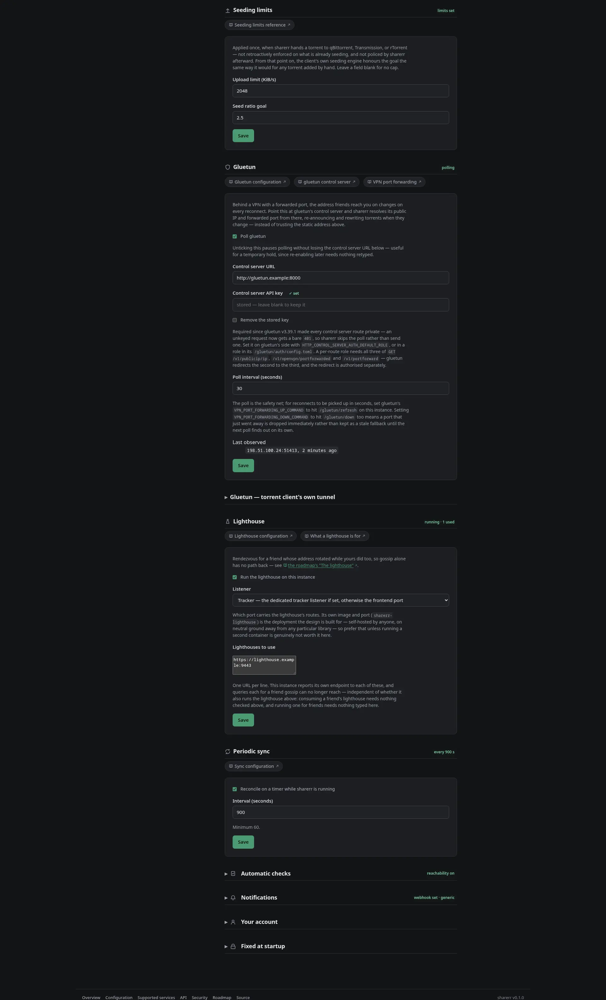

# sharerr

> EXPERIMENTAL UNTIL v1.0.0

_Share your media library with friends, over the tools you already run._

<!-- All three release badges read the same GitHub Release version, on purpose.
docker.yml's `release` job now waits on both images being published (a single
`publish` job promotes them together - see docs/RELEASING.md), so the two can
never drift apart - but shields.io has no GHCR version endpoint to ask
instead, so reading the Release version is still how all three stay in sync. -->

[](https://github.com/ivylikethevine/sharerr-rs/releases/latest)
[](https://github.com/ivylikethevine/sharerr-rs/pkgs/container/sharerr-rs)
[](https://github.com/ivylikethevine/sharerr-rs/pkgs/container/sharerr-lighthouse)
[](https://github.com/ivylikethevine/sharerr-rs/actions/workflows/coverage.yml)
[](https://github.com/ivylikethevine/sharerr-rs/actions/workflows/coverage.yml)
[](https://www.bestpractices.dev/projects/14449)
[](https://scorecard.dev/viewer/?uri=github.com/ivylikethevine/sharerr-rs)
[](https://www.bestpractices.dev/projects/14449)
[](https://github.com/ivylikethevine/sharerr-rs/blob/main/Cargo.toml)

sharerr connects to your *arr apps (Sonarr, Radarr, Lidarr, Readarr,
Whisparr), finds everything tagged `sharerr`, builds a torrent for each file
**where it already sits**, seeds it through your torrent client (qBittorrent,
Transmission or rTorrent), and publishes the lot as a Torznab feed. Your
friend adds that feed to their Prowlarr; their Sonarr and Radarr then find
your releases with the TVDB/TMDb/IMDb ids attached, so a release matches a
known series or film rather than being guessed from its filename.

Nothing is copied, renamed, re-linked, or moved. That is the constraint the
whole design is built around.

> View these docs as a [website](https://ivylikethevine.github.io/sharerr-rs/).
> The reference material is indexed in [docs/README.md](docs/README.md);
> deployment layouts are in [docker/deploy/](docker/deploy/README.md).

## Contents

- [What works today](#what-works-today)
- [Screenshots](#screenshots)
- [Quickstart](#quickstart)
- [Sharing with a friend](#sharing-with-a-friend)
  - [The tracker](#the-tracker)
  - [Seeding limits](#seeding-limits)
  - [A dynamic endpoint (gluetun)](#a-dynamic-endpoint-gluetun)
  - [The lighthouse](#the-lighthouse)
- [Sharing music, books, and more](#sharing-music-books-and-more)
- [Friends finding each other](#friends-finding-each-other)
- [Topology](#topology)
  - [Checking that you are actually reachable](#checking-that-you-are-actually-reachable)
- [Sharing a plain directory, no \*arr app at all](#sharing-a-plain-directory-no-arr-app-at-all)
- [Authenticating to qBittorrent](#authenticating-to-qbittorrent)
  - [If a correct key is rejected](#if-a-correct-key-is-rejected)
- [Using Transmission instead of qBittorrent](#using-transmission-instead-of-qbittorrent)
- [Using rTorrent / ruTorrent instead of qBittorrent](#using-rtorrent--rutorrent-instead-of-qbittorrent)
- [The CLI](#the-cli)
- [Building and testing](#building-and-testing)
- [Layout](#layout)
- [Roadmap](#roadmap)
  - [Before v1](#before-v1)
  - [Open work](#open-work)
- [Getting help and contributing](#getting-help-and-contributing)
- [AI usage](#ai-usage)
- [Licence](#licence)

## What works today

- **Sources**: discovery by tag from Sonarr, Radarr, Lidarr, Readarr and
  Whisparr, or a plain directory with no *arr app at all.
- **Seeding**: torrents built in place, files never moved; seeding through
  qBittorrent, Transmission or rTorrent/ruTorrent; per-torrent upload cap and
  seed-ratio goal; a built-in BitTorrent tracker served by sharerr itself.
- **The feed**: Torznab for Prowlarr, Jackett-compatible URLs and JSON
  results, media metadata in the release (resolution, codecs, channels,
  runtime; sample rate, bit depth and real format for audio).
- **Friends**: per-friend keys with revoke and last-seen; per-friend scoping
  (this friend sees TV, that one films); revoking a friend cuts tracker
  access too; safe rotation of the shared announce token; peer endpoint
  memory, signed endpoint gossip between friends, and the lighthouse for a
  friend whose address rotated while nobody was watching.
- **Networking**: a dynamic endpoint from gluetun (rotating exit IP and
  forwarded port), a Topology page drawing sources, this instance and
  friends in one picture, a live per-torrent swarm view with hourly history,
  and a reachability script for checking from outside your network.
- **The web UI**: first-run wizard, settings with connection tests, an Items
  page with per-item detail and manual retry/rebuild/unshare, library
  composition, sync history, self-refreshing status tiles, and path-mapping
  diagnostics.
- **Operations**: webhook notifications (generic, Discord, Apprise) on nine
  triggers plus an Uptime-Kuma-style heartbeat, config backup and restore, `/metrics` (OpenMetrics) and a
  dashboard-widget JSON endpoint behind a bearer token, and an OpenAPI 3.1
  document for the machine-facing API.

Which apps, clients and indexers are supported, how the three clients differ,
and what was tried and deliberately left out is in
[`docs/SUPPORT.md`](docs/SUPPORT.md).

## Screenshots

|                                             |                                                                         |
| ------------------------------------------- | ----------------------------------------------------------------------- |
|      |                                    |
|  |  |
|      |                                    |

Settings is one long page; it is shown here in four parts, top to bottom.

|                                                                            |                                                                                                      |
| -------------------------------------------------------------------------- | ---------------------------------------------------------------------------------------------------- |
|  |                                         |
|    |  |

## Quickstart

```bash
docker run -d --name sharerr \
  -p 8477:8477 \
  -e SHARERR_MASTER_KEY="$(openssl rand -base64 32)" \
  -v sharerr-config:/config \
  -v sharerr-data:/data \
  -v /path/to/library:/media:ro \
  ghcr.io/ivylikethevine/sharerr-rs:latest
```

> `:latest` tracks the newest tagged release. To pin a specific version, use
> `ghcr.io/ivylikethevine/sharerr-rs:vX.Y.Z`, or to track `main` between
> releases, `ghcr.io/…:sha-<commit>` (see
> [the tag scheme](docs/RELEASING.md#the-tag-scheme)). Building it yourself
> with `docker build -f docker/Dockerfile -t sharerr-rs .` works too.

Then open `http://localhost:8477/`. The first visit asks you to create an
account; whoever gets there first claims the instance, so do it now rather
than leaving it reachable and unclaimed. A short **wizard** walks through the
Sonarr and Radarr URLs and API keys, the qBittorrent URL and API key, the
path mappings, and the tracker's advertised host, or skip it and use
**Settings**, which holds the same fields and everything else. Each service
has a _Test connection_ button, and saving takes effect within a second or
two, no restart.

Three things to know before going further:

- **`SHARERR_MASTER_KEY` is the one thing that cannot come from the UI**,
  because it encrypts the vault the UI writes into. Keep it: losing it means
  losing every stored credential. See
  [vault secrets](docs/SETTINGS.md#vault-secrets).
- **Two volumes matter.** `/data` holds the vault, the database, and the
  generated `.torrent` files; `/config` holds `sharerr.toml`, which the UI
  rewrites in place. Both must persist. Compose layouts for the common shapes
  are in [`docker/deploy/`](docker/deploy/README.md).
- **Port 8477 carries the web UI, the tracker, and the feed.** Anyone who
  can reach it can reach the login page, and on a plain-HTTP LAN the session
  cookie travels in the clear. See
  [the security policy](docs/SECURITY.md#what-is-in-scope) for what a
  TLS-terminating proxy in front changes.

## Sharing with a friend

sharerr publishes what it shares as a **Torznab** feed, which is what
Prowlarr speaks. Open **Friends**, add your friend by name, and sharerr
generates a key just for them, shown once, alongside the feed URL. They add a
_Generic Torznab_ indexer in their Prowlarr using those two values.

Because each friend has their own key, the Friends page can tell you when
each of them last used the feed ("never" means they have the key but have
not finished setting up), and revoking one person leaves everybody else
working. That key is also what the feed embeds as the announce token, so
revoking a friend cuts their access to sharerr's tracker too, instantly, with
no effect on anyone else. You can also scope what each friend sees:
everything, or only TV, films, music or books. Content outside a friend's
scope is never listed and never offered, and they cannot search their way
around it.

> There is no shared feed key. A single `torznab.api_key` would open the
> feed for everybody and make revoking one friend meaningless, so a
> `sharerr.toml` carrying a `[torznab]` section is rejected as an unknown
> key. Issue each friend their own.

If your friend has a client set up for **Jackett** rather than Prowlarr, it
works unmodified: sharerr answers Jackett's URL shape
(`/api/v2.0/indexers/<anything>/results/torznab/api`) with the same feed,
plus its read-only admin endpoints. Jackett's _write_ endpoints are not
implemented; a client that calls one gets a `501` and sharerr logs the exact
method and path.

**Tag something before your friend adds the indexer.** Sonarr and Radarr
treat an empty feed as a failed test, so an indexer added before anything is
shared will not validate, even though nothing is wrong.

The feed lists only what is actually seeding, and both the feed and the
`.torrent` downloads require the key. The feed URL is built from
`tracker.advertised_host`, so that has to be an address your friend can
reach; whatever you do to make port 8477 reachable also makes the tracker
and the feed reachable.

### The tracker

sharerr serves `/announce` and `/scrape` from its own process, whichever
torrent client seeds, and answers only for torrents sharerr made. Optionally
generate an announce token under Settings → Tracker: it is embedded in the
announce URL of every torrent built afterwards, so holding the `.torrent` is
what grants the right to announce.

Rotating that token does not cut off torrents already published. The old
token keeps working, unattributed, alongside the new one until you
explicitly finish the rotation from Settings; the page shows whether
anything has used the old token since, so you can wait until nothing has.
This is a safety net for the _shared_ token, not a substitute for per-friend
revocation above.

One caveat: the announce endpoint is part of `sharerr serve`, so a one-shot
`sharerr sync` produces correct torrents whose announces fail until `serve`
is running. Field reference: [`[tracker]`](docs/SETTINGS.md#tracker).

### Seeding limits

Settings → Seeding limits takes an upload-speed cap (KiB/s) and a seed-ratio
goal, applied to each torrent as sharerr hands it to the client and restated
on the torrents sharerr already created whenever a value changes:

```toml
[seeding]
upload_limit_kib = 500
ratio_limit = 2.0
```

The client's own seeding engine honours them from then on, the same as for a
torrent added by hand. A changed value reaches every torrent sharerr created
on the next sync pass, once; a torrent sharerr adopted keeps whatever limits
it had. A blank field is no opinion rather than "no cap": sharerr sends
nothing for it, so a limit you want gone comes off in the client. rTorrent
honours the cap but not the ratio; see
[`docs/SUPPORT.md`](docs/SUPPORT.md#torrent-clients-what-actually-seeds).

The same panel also holds two settled "Before v1" roadmap questions, since an
operator reasons about them together:

```toml
[seeding]
private = true      # default
[feed]
magnet_links = false # default
```

`seeding.private` sets BEP 27's private flag on torrents built from then on
— on by default, which is the whole reason sharerr's own tracker exists.
Turning it off lets a client also find peers via DHT and PEX, which means
**revoking a friend no longer removes them from that torrent's swarm**.
`feed.magnet_links` makes the Torznab and Jackett feeds advertise a magnet
alongside the `.torrent` link, off by default because a magnet can never
resolve against a private torrent. Turning it on only ever produces a magnet
for an item that is itself not private; the combination "magnets on,
everything still private" is accepted but produces nothing, rather than
advertising a link guaranteed to stall a friend's client. See
[`docs/SUPPORT.md`](docs/SUPPORT.md#the-feeds-magnet-link) for why this was
an open question and how it was resolved.

### A dynamic endpoint (gluetun)

Behind a VPN with provider port forwarding there is no stable address to
type into `tracker.advertised_host`. Point sharerr at gluetun's control
server instead:

```toml
[gluetun]
control_url = "http://localhost:8000"   # sharerr inside gluetun's namespace
poll_secs = 60
```

sharerr polls gluetun for the exit IP and forwarded port, and torrents carry
an announce _list_ spanning the recently held endpoints, so a friend's client
falls back through older tiers after a rotation. When the endpoint changes,
sharerr rewrites every cached `.torrent` (the info hash is untouched) and
repoints the tracker lists inside the torrent client immediately. For
reconnects to be picked up in seconds, set gluetun's
`VPN_PORT_FORWARDING_UP_COMMAND` to `wget -qO- http://localhost:8477/gluetun/refresh`
and `VPN_PORT_FORWARDING_DOWN_COMMAND` to `wget -qO- http://localhost:8477/gluetun/down`;
both only nudge sharerr to re-ask the control server. gluetun's control
server requires an API key (`gluetun.api_key` in Settings); without one
sharerr skips the poll rather than send a request that can only fail.

Two related settings for constrained setups: `tracker.advertised_url` takes
a full base URL for reverse-proxied instances, and `tracker.bind` opens a
second listener carrying only the tracker, for the topology where exactly
one forwarded port exists and it has to be the tracker's. If the torrent
client sits behind a _different_ gluetun than sharerr does, a second poller,
`[gluetun_client]`, watches that tunnel with the same fields; that layout is
[`docker/deploy/dual-vpn/`](docker/deploy/dual-vpn/README.md).

Field reference and how to mint gluetun's key:
[`[gluetun]`](docs/SETTINGS.md#gluetun-and-gluetun_client) and
[deploying](docker/deploy/README.md).

### The lighthouse

Gossip only helps a friend who can still reach _somebody_; two friends whose
addresses both rotated while neither was watching have no path back to each
other. The lighthouse is the rendezvous for that case: a `key hash → latest
endpoint` service, independent of the rest of sharerr, that a peer reports
its endpoint to and a friend looks up under the key that peer issued them. A
request without a valid key gets a plausible fabricated answer rather than
an error, so scraping it yields only noise.

Using one is a Settings → Lighthouse field:

```toml
[lighthouse]
urls = ["https://a-friends-lighthouse.example"]
```

Running one, either as its own container (`sharerr-lighthouse`, its own
image on port 7878) or embedded on one of sharerr's own listeners, and the
design behind the fabricated answers, are in
[`docs/LIGHTHOUSE.md`](docs/LIGHTHOUSE.md).

## Sharing music, books, and more

Each *arr app is its own optional section, and any combination works:

```toml
[lidarr]
url = "http://localhost:8686"

[readarr]
url = "http://localhost:8787"

[whisparr]
url = "http://localhost:6969"
```

Then store each key: `printf %s "$KEY" | sharerr vault set lidarr.api_key`.

- **Tags live on the artist and the author**, not the album or the book, so
  tagging one shares their whole discography or catalogue, the same way
  tagging a Sonarr series shares every episode.
- **Lidarr and Readarr are on API v1**, Sonarr/Radarr/Whisparr on v3. sharerr
  picks the right one per app; you only supply the base URL.
- **Whisparr content is categorised as XXX**, not TV, and a friend scoped to
  "TV only" does **not** receive it. Only an unscoped friend does.

## Friends finding each other

A peer is an identity, not just a credential: sharerr remembers _where_ each
friend was recently seen, with their feed traffic and their torrent client
recorded separately (a dual-VPN friend has the two behind different exits).
Sightings come from authenticated feed pulls, from **gossip** (when a friend
also runs sharerr, the two instances exchange signed endpoint records over
the same per-friend key the feed uses, so one friend noticing a moved
address is enough for everyone who already knows them), and, when gossip has
no path back to a quiet friend, from a lighthouse, ranked below both.

The trust model, stated plainly: every record is Ed25519-signed by the peer
it describes, so a friend can relay it but never rewrite it; an older record
never overwrites a newer one; a peer's identity key is pinned on first use;
and a gossip pull returns only records for peers the caller proves they
already know.

Set it up per friend on the Friends page: their sharerr's URL, and the key
they issued you. Leave both empty and your instance still answers their
pulls and accepts their pushes; it just never initiates.

A friend who stops showing up can be reported rather than noticed: with a
webhook URL stored as `notifications.webhook_url`, sharerr POSTs there on
whichever of nine triggers are enabled (a sync failing, a friend going quiet
or making first contact, the advertised endpoint rotating or the tracker
behind it going unreachable, items newly shared or failing to share, a
library path becoming unreadable, a friend's key being revoked), as generic
JSON, a Discord webhook, or an Apprise `/notify`. A tenth, the heartbeat,
goes the other way: a push to an Uptime-Kuma-style URL while the instance is
ready, so a monitor notices the silence. Field reference:
[`[notifications]`](docs/SETTINGS.md#notifications).

## Topology

The **Topology** page is one diagram of how this instance connects to
everything around it: library sources on the left, this instance and its
torrent client in the middle, friends on the right. It draws nothing new;
every fact on it already lives on Settings, Status, or the Friends page. A
solid line to a friend means their address was seen directly, dashed means
gossip relayed it, dotted means a lighthouse answered it. Under the diagram,
**Torrent client** shows what the client is actually doing (the one place a
torrent paused or removed behind sharerr's back shows up) and **Active
swarms** lists who is connected to each torrent right now.

**Networking only** (`/topology?view=networking`) hides the sources lane.
Addresses are redacted by default so the page is safe to screenshot; a
checkbox reveals them. Both choices are remembered per browser.

### Checking that you are actually reachable

Two separate things, because they answer different questions. Settings →
Automatic checks has an opt-in **reachability** probe that dials this
instance's own advertised addresses from the Topology page; a failure there
says _could not confirm_ rather than "your port is shut", because a host
dialling its own public address is exercising NAT hairpinning, which plenty
of working routers refuse.

The **Debug** page settles it. It shows what sharerr believes its own
addresses are and hands you a `bash` + `curl` script with them filled in.
Run it from somewhere else (a phone off wifi, a VPS) and it reports whether
the tracker and the feed are reachable from outside. Any HTTP status counts
as reachable: the feed answering `401` still proves the port is open.

## Sharing a plain directory, no *arr app at all

Point sharerr at a folder and everything in it is shared:

```toml
[[library]]
path = "/media/extras"
kind = "movie"   # tv, movie, music, or book

[[library]]
path = "/media/tapes"
kind = "tv"
```

Each entry is scanned recursively; being in the directory is the tag, and
`kind` decides the feed category and which scoped friends see it.

- **No external ids travel with these releases.** A friend's app matches
  them by parsing the release name alone, so name files the way releases are
  named: `Show.Name.S01E02.mkv`, `Film.Title.2019.mkv`. A `tv` file with no
  `SxxEyy` in its name is skipped (and `doctor` says so).
- **Music and books lean on the directory layout**: `Artist/Album/01 - Track.flac`
  and `Author/Title.epub`.
- **One file, one torrent.** An album is shared per track file.
- The directory is never modified, same as everywhere else in sharerr.

## Authenticating to qBittorrent

sharerr signs in with a qBittorrent 5.2+ WebUI API key: stateless, no
session to expire. Generate one under Options → Web UI → API key, then:

```bash
printf %s "$KEY" | sharerr vault set qbittorrent.api_key
```

Rotating the key in qBittorrent invalidates the old one immediately, so
store the new one at the same time. Older builds without the API key feature
are not supported.

### If a correct key is rejected

**qBittorrent validates the `Host` header's port** against the port it
listens on, and answers `401` before it reads the key when they differ. A
remapped docker port (`-p 18080:8080`) or a reverse proxy on another port
trips this. Either point `qbittorrent.url` at the port qBittorrent itself
listens on, or turn off Options → Web UI → _Validate Host header_.
`sharerr doctor` names this, rather than reporting "rejected the API key".

## Using Transmission instead of qBittorrent

```toml
torrent_backend = "transmission"

[transmission]
url = "http://localhost:9091"
username = "transmission"
label = "sharerr"   # stands in for qBittorrent's category and tag
```

Then store the password: `printf %s "$PW" | sharerr vault set transmission.password`.
Transmission cannot skip the hash check, so the first add of a large library
is slower; the full comparison of the three clients is in
[`docs/SUPPORT.md`](docs/SUPPORT.md#torrent-clients-what-actually-seeds).

## Using rTorrent / ruTorrent instead of qBittorrent

rTorrent has no HTTP server of its own, so `rtorrent.url` is the exact
address your reverse proxy answers XML-RPC requests on (commonly `/RPC2`, or
ruTorrent's `/plugins/httprpc/action.php`), not a base address sharerr
appends a path to:

```toml
torrent_backend = "rtorrent"

[rtorrent]
url = "http://seedbox.example/RPC2"
username = "rtorrent"
label = "sharerr"   # stored in rTorrent's d.custom1 field
```

Then store the password: `printf %s "$PW" | sharerr vault set rtorrent.password`.
Username and password are HTTP Basic Auth for the reverse proxy in front of
the RPC endpoint; if yours has none, any placeholder values work. rTorrent
always verifies on add, honours the upload cap but not the ratio limit, and
cannot replace a stale tracker in place; see
[`docs/SUPPORT.md`](docs/SUPPORT.md#torrent-clients-what-actually-seeds).

## The CLI

The UI covers everything, but each verb has a headless equivalent, which is
what a scripted deployment or a secrets manager wants. Every command takes
`--config <path>` (or `SHARERR_CONFIG`) and `--verbose`.

| Command | What it does |
| --- | --- |
| `sharerr serve` | The long-running mode: HTTP, the tracker, the feed, and the reconciliation loop. What the container runs. |
| `sharerr sync` | One reconciliation pass, then exit. `--dry-run` reports what it would do without touching the client. |
| `sharerr doctor` | Checks credentials, service reachability, the tag, and **path mapping resolution**, the check most likely to explain "nothing is shared". The same checks back the web UI's Status page. `--fix` creates a missing tag or category; `--suggest-paths` proposes `[[path_map]]` rules by matching tagged files against a mounted directory (`--search-root`, default `/media`), never written automatically. |
| `sharerr vault set <key>` | Reads a secret from stdin into the encrypted vault. |
| `sharerr vault list` | Lists which secret keys are set, without their values. |
| `sharerr vault remove <key>` | Deletes a secret from the vault. |
| `sharerr openapi` | Prints the OpenAPI 3.1 document for the machine-facing API (`--output` writes it to a file). See [`docs/API.md`](docs/API.md). |
| `sharerr preview` | Serves every authenticated page with invented data on `127.0.0.1:4877` (`--bind` to change it), for checking the UI's layout with no instance behind it. A development aid. |

```bash
printf %s "$SONARR_API_KEY" | docker exec -i sharerr sharerr vault set sonarr.api_key
docker exec sharerr sharerr doctor
```

Any setting can also come from the environment (`SHARERR_QBITTORRENT__URL`
sets `qbittorrent.url`); a field pinned that way renders disabled in the UI.
See [environment variable overrides](docs/SETTINGS.md#environment-variable-overrides).

## Building and testing

Rust **1.98** or newer, then the verification loop:

```bash
cargo test --workspace --all-features --locked \
  && cargo clippy --workspace --all-targets --all-features --locked -- -D warnings \
  && cargo build \
  && cargo fmt --all --check
```

The default suite is hermetic: no network, no containers, no database. An
opt-in second tier (`./scripts/run_docker_tests.sh`) drives a real *arr +
torrent-client stack on synthetic fixtures. [`docs/CONTRIBUTING.md`](docs/CONTRIBUTING.md)
has the lint policy, the MSRV check, and what CI runs;
[`docs/TESTING.md`](docs/TESTING.md) has the tiers.

## Layout

Twelve crates, one workspace, two binaries. The crate map, how a share moves
end to end, and where state lives are in
[`docs/ARCHITECTURE.md`](docs/ARCHITECTURE.md); the original design brief and
the two premises the implementation disproved are in
[`docs/DESIGN.md`](docs/DESIGN.md).

## Roadmap

Where sharerr is going next. Nothing below is a release commitment; the
ordering is a judgement about value, not a schedule. An item is removed the
moment it ships. An idea that gets declined instead moves to
[`docs/SUPPORT.md`](docs/SUPPORT.md#not-supported), with the reason
attached.

### Before v1

Operational tasks that stand between the current 0.1.x releases and a 1.0,
not features:

- **Rehearse one real upgrade across a migration.** Twelve forward-only
  sqlx migrations exist, all only ever run against a fresh database.

### Open work

Smallest first, by how much each item touches:

- **A public lighthouse.** The software is done; what is missing is a
  public instance for a friend group that would rather not run their own.
- **Transfer accounting.** The tracker resolves which friend an announce
  belongs to but discards the `uploaded`/`downloaded` totals it carries.
  Keeping them would unlock a per-friend "served" indicator and a real
  bytes-out figure on the status page.
- **Request flow.** Discovery is one-way today. An inbound request queue
  with an approve step is the other half of the original idea.

## Getting help and contributing

- **Found a bug or want a feature?** [Open an issue](https://github.com/ivylikethevine/sharerr-rs/issues);
  see [`docs/SUPPORT.md`](docs/SUPPORT.md) for what is supported today and
  [the roadmap](#roadmap) for what is already planned or considered.
- **Have a question, or want to show off your setup?** [Start a discussion](https://github.com/ivylikethevine/sharerr-rs/discussions).
- **Found a security issue?** Do not open a public issue; see
  [`docs/SECURITY.md`](docs/SECURITY.md#reporting-a-vulnerability).
- **Want to contribute a change?** [`docs/CONTRIBUTING.md`](docs/CONTRIBUTING.md),
  and the [code of conduct](docs/CODE_OF_CONDUCT.md) for any project space.
- **Wondering who's behind this?** [`docs/GOVERNANCE.md`](docs/GOVERNANCE.md):
  a personal project, maintained by one person in their spare time.

## AI usage

Heavily inspired by: [Dictionarry/Profilarr's AI Transparency Statement](https://v2.dictionarry.dev/ai-transparency)

I have used generative AI to write large parts of this project. All of the code here is my responsibility regardless: AI is a tool, not an owner of a project. I have personally understood, reviewed and approved all of the AI-generated code in this repository, and _mainline releases_ carry the same accountability to me as anything I write and publish myself.

## Licence

MIT — see [LICENSE](./LICENSE.md).
