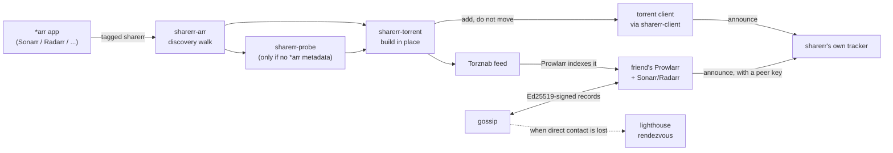

# Architecture

How the pieces fit together. [The design brief](DESIGN.md) explains why
sharerr is shaped this way; [the lighthouse's design rationale](LIGHTHOUSE.md)
and [the API reference](API.md) go deeper on two specific parts this page
only summarizes. This page is the map between those: what each crate owns,
how a share moves from a tagged *arr item to a friend's Sonarr, and where the
trust boundaries actually sit.

## Table of contents

- [Crate map](#crate-map)
- [How a share moves](#how-a-share-moves)
- [Trust boundaries](#trust-boundaries)
- [Where state lives](#where-state-lives)

## Crate map

Twelve crates under `crates/`, one workspace, one binary
([the README's layout table](../README.md#layout) is the source for this —
kept here rather than duplicated with different wording):

| Crate | Owns |
| --- | --- |
| `sharerr` | The binary: CLI, web UI, Torznab/Jackett, tracker, reconciliation, directory libraries, gossip, lighthouse client, notifications |
| `sharerr-core` | Domain types, layered config, path mapping. No I/O |
| `sharerr-arr` | Sonarr/Radarr/Lidarr/Readarr/Whisparr clients and tagged-content discovery |
| `sharerr-client` | The narrow trait a torrent client backend implements |
| `sharerr-qbit` | qBittorrent WebUI client |
| `sharerr-transmission` | Transmission RPC client |
| `sharerr-rtorrent` | rTorrent XML-RPC client |
| `sharerr-store` | Encrypted vault + SQLite store |
| `sharerr-torrent` | Torrent construction and tracker resolution |
| `sharerr-probe` | Reads what a media file is, where no *arr can say |
| `sharerr-lighthouse` | The lighthouse rendezvous service — its own binary too |
| `sharerr-testkit` | Synthetic fixtures. Never in a release build |

`sharerr-core` sits at the bottom with no I/O of its own, so every other
crate can depend on its types without pulling in a client, a database, or a
web framework. `sharerr-client` is a trait, not an implementation — `sharerr`
talks to whichever of `sharerr-qbit`, `sharerr-transmission`, or
`sharerr-rtorrent` the operator configured through that one interface,
which is what lets a torrent-client backend be swapped without touching the
reconciliation loop that drives it. `sharerr-lighthouse` is deliberately
independent of the rest of the workspace — it is a separate service with a
separate threat model (see [its own doc](LIGHTHOUSE.md)), not a module of
the main binary that happens to ship as one.

## How a share moves

1. **Discovery**: `sharerr-arr` walks the configured Sonarr/Radarr/etc.
   instances for items tagged `sharerr`, carrying whatever TVDB/TMDb/IMDb
   metadata that *arr app already has.
2. **Metadata fallback**: for a plain directory with no *arr app behind it,
   `sharerr-probe` reads the media file itself instead — see
   [`docs/SUPPORT.md`](SUPPORT.md) for which formats.
3. **Torrent construction**: `sharerr-torrent` builds a `.torrent` describing
   the file **where it already sits** — never copied, renamed, or re-linked,
   the constraint [the design brief](DESIGN.md#what-the-brief-got-right)
   is built around.
4. **Seeding**: the torrent is added to whichever client backend is
   configured, through the shared `sharerr-client` contract, with
   `skip_checking` set so the client seeds immediately rather than
   re-verifying data sharerr never wrote.
5. **Publishing**: the release is served over sharerr's own Torznab feed. A
   friend's Prowlarr indexes that feed; their Sonarr/Radarr then match the
   release against a known series or film by id, not by parsing a filename.
6. **Tracking**: sharerr runs its own BitTorrent tracker (see
   [the README](../README.md#the-tracker)) — announces authenticate with a
   peer's key, and the tracker fails closed on any vault or database
   failure rather than admitting an unauthenticated announce.
7. **Finding each other**: gossip exchanges signed endpoint records directly
   between friends; when direct contact is lost (both addresses rotated at
   once), the lighthouse rendezvous is the fallback path — see
   [`docs/LIGHTHOUSE.md`](LIGHTHOUSE.md) for why it can do that without
   learning who is asking.

## Trust boundaries

- **Operator ↔ vault**: the only secret the operator must hold outside
  sharerr is `SHARERR_MASTER_KEY`. Everything downstream of it (*arr keys,
  torrent-client credentials, the tracker token, gossip signing key) is
  encrypted at rest by `sharerr-store`'s vault and never written to
  `sharerr.toml` — see [`CLAUDE.md`](https://github.com/ivylikethevine/sharerr-rs/blob/main/CLAUDE.md)'s
  "Secrets never go in `sharerr.toml`" for the one documented, self-deleting
  exception.
- **This instance ↔ a friend**: a friend authenticates with a peer key this
  instance issued them, scoped to what that key can see (`PeerScope`). Gossip
  records are Ed25519-signed by the peer they describe, so a compromised or
  malicious relay in between can drop a record but never forge or replay an
  older one.
- **This instance ↔ the lighthouse**: the lighthouse is treated as an
  untrusted, semi-public relay by design — it holds no proof it could not
  itself forge for an unauthenticated query (see
  [`docs/LIGHTHOUSE.md`](LIGHTHOUSE.md#telling-a-real-record-from-a-decoy)),
  and a sharerr instance ranks anything it returns below a direct sighting
  of the same peer.
- **This instance ↔ the services it drives**: *arr apps, the torrent client,
  and gluetun are all assumed to be under the same operator's control, on
  the same trusted network sharerr itself is meant to run on — see
  [`docs/SECURITY.md`](SECURITY.md#why-the-existing-controls-are-enough) for
  the threat model that boundary sits inside of.

## Where state lives

- **`sharerr-store`**: one SQLite database (peers, sessions, user accounts)
  plus the encrypted vault file, both under the configured data directory.
- **`sharerr.toml`**: non-secret configuration only — service endpoints, path
  mappings, feature toggles. Rewritten in place by the web UI via `toml_edit`,
  comments and all.
- **In memory only**: session tokens (a restart revokes every session) and
  the gossip peer-endpoint cache.
- **Nothing outside the configured services**: no telemetry, no external
  calls beyond what an operator configured — see
  [the design brief](DESIGN.md#the-no-egress-requirement-is-not-enforced-by-the-test-stack)
  for how that property is tested.
