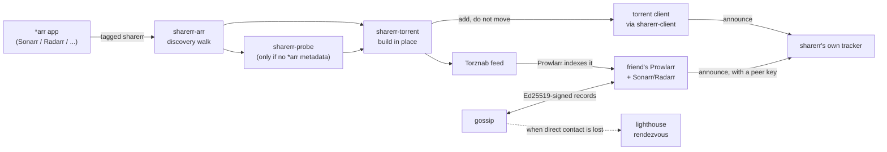

# Architecture

How the pieces fit together: what each crate owns, how a share moves from a
tagged *arr item to a friend's Sonarr, where the trust boundaries sit, and
where state lives. [The design brief](DESIGN.md) explains why sharerr is
shaped this way; [the lighthouse doc](LIGHTHOUSE.md) and [the API
reference](API.md) go deeper on two parts this page only summarises.

## Table of contents

- [Crate map](#crate-map)
- [How a share moves](#how-a-share-moves)
- [Trust boundaries](#trust-boundaries)
- [Where state lives](#where-state-lives)
- [Refactors weighed and declined](#refactors-weighed-and-declined)

## Crate map

Twelve crates under `crates/`, one workspace, two binaries (`sharerr` and
`sharerr-lighthouse`). This table is the one place the crate list is kept;
everything else links here.

| Crate | Owns |
| --- | --- |
| `sharerr` | The binary: CLI, web UI, Torznab/Jackett, tracker, reconciliation, directory libraries, gossip, lighthouse client, notifications |
| `sharerr-core` | Domain types, layered config, path mapping. No I/O, so every other crate can depend on it without pulling in a client, a database, or a web framework |
| `sharerr-arr` | Sonarr/Radarr/Lidarr/Readarr/Whisparr clients and tagged-content discovery |
| `sharerr-client` | The narrow `TorrentClient` trait a backend implements. `sharerr` talks to whichever backend is configured through this one interface, so a backend can be swapped without touching the reconciliation loop |
| `sharerr-qbit` | qBittorrent WebUI client |
| `sharerr-transmission` | Transmission RPC client |
| `sharerr-rtorrent` | rTorrent XML-RPC client |
| `sharerr-store` | Encrypted vault + SQLite store |
| `sharerr-torrent` | Torrent construction and tracker resolution |
| `sharerr-probe` | Reads what a media file is, where no *arr can say |
| `sharerr-lighthouse` | The lighthouse rendezvous service, its own binary and image. Deliberately independent of the rest of the workspace: a separate service with a separate threat model, not a module of the main binary |
| `sharerr-testkit` | Synthetic fixtures. Never in a release build |

## How a share moves

1. **Discovery**: `sharerr-arr` walks the configured *arr instances for items
   tagged `sharerr`, carrying whatever TVDB/TMDb/IMDb metadata the app
   already has.
2. **Metadata fallback**: for a plain directory with no *arr app behind it,
   `sharerr-probe` reads the media file itself. See
   [`docs/SUPPORT.md`](SUPPORT.md) for which formats.
3. **Torrent construction**: `sharerr-torrent` builds a `.torrent` describing
   the file **where it already sits**. Never copied, renamed, or re-linked:
   the constraint [the design brief](DESIGN.md#what-the-brief-got-right) is
   built around.
4. **Seeding**: the torrent is added to the configured client through the
   `sharerr-client` contract, with `skip_checking` set where the client
   supports it so it seeds immediately rather than re-verifying data sharerr
   never wrote.
5. **Publishing**: the release is served over sharerr's own Torznab feed. A
   friend's Prowlarr indexes it; their Sonarr/Radarr match the release by id,
   not by parsing a filename.
6. **Tracking**: sharerr runs its own BitTorrent tracker (see
   [the README](../README.md#the-tracker)). Announces authenticate with a
   peer's key, and the tracker fails closed on any vault or database failure.
7. **Finding each other**: gossip exchanges signed endpoint records directly
   between friends; when both addresses rotated at once, the lighthouse is
   the fallback. See [`docs/LIGHTHOUSE.md`](LIGHTHOUSE.md) for why it can do
   that without learning who is asking.

## Trust boundaries

- **Operator ↔ vault**: the only secret the operator holds outside sharerr is
  `SHARERR_MASTER_KEY`. Everything downstream of it (*arr keys, client
  credentials, the tracker token, the gossip signing key) is encrypted at
  rest by `sharerr-store`'s vault and never written to `sharerr.toml`. The
  one documented, self-deleting exception is the `[[peers]]` restore block;
  see [`docs/SETTINGS.md`](SETTINGS.md#restoring-friends-after-a-full-data-directory-loss).
- **This instance ↔ a friend**: a friend authenticates with a peer key this
  instance issued them, scoped to what that key can see (`PeerScope`). Gossip
  records are Ed25519-signed by the peer they describe, so a relay in between
  can drop a record but never forge or replay an older one.
- **This instance ↔ the lighthouse**: treated as an untrusted, semi-public
  relay. It holds no proof it could not itself forge for an unauthenticated
  query (see [the lighthouse doc](LIGHTHOUSE.md#telling-a-real-record-from-a-decoy)),
  and anything it returns ranks below a direct sighting of the same peer.
- **This instance ↔ the services it drives**: *arr apps, the torrent client,
  and gluetun are assumed to be under the same operator's control, on the
  trusted network sharerr is meant to run on. See
  [`docs/SECURITY.md`](SECURITY.md#why-the-existing-controls-are-enough) for
  the threat model that boundary sits inside.

## Where state lives

- **`sharerr-store`**: one SQLite database under `data_dir` (`shared_items`,
  `sync_runs`, `users`, `peers`, `peer_endpoints`, `swarm_samples`) plus the
  encrypted vault file and the generated `.torrent` files.
- **`sharerr.toml`**: non-secret configuration only. Rewritten in place by
  the web UI via `toml_edit`, comments and all.
- **In memory only**: session tokens (a restart revokes every session).
- **Nothing outside the configured services**: no telemetry, no external
  calls beyond what an operator configured. See
  [the design brief](DESIGN.md#the-no-egress-requirement-is-not-enforced-by-the-test-stack)
  for how that property is tested.

## Refactors weighed and declined

Candidates from a whole-codebase simplify pass, checked and rejected. Kept so
the same shape is not re-proposed by a later pass over the same code.

- **The three `poll_loop`s** (`system_stats.rs`, `gluetun.rs`,
  `swarm_history.rs`) share only `loop { work; sleep }` over different bodies
  and intervals. Unifying them is over-abstraction.
- **`tracker.rs`'s `#[allow(dead_code)]`** on `AnnounceParams`/`ScrapeParams`:
  documentation-only utoipa shapes with a stated reason.
- **`doctor.rs` vs `checks.rs`**: the parallel `check_*` names are not
  duplication; `doctor.rs` delegates into `checks::` and wraps for reporting.
- **`sharerr-transmission` as one file**: at ~550 production lines it is
  under the threshold where a module split pays for itself.
- **`sharerr-probe`'s two metadata loops** (Matroska, ISO-BMFF): track
  types, codec accessors, and the `und`-language case differ enough that
  sharing costs more than it saves.
- **`sharerr-probe` vs `MediaMeta::scene_*`**: the probe deliberately does
  not duplicate core's scene-token mapping; the split is documented in
  `sharerr-probe` itself.
- **`sharerr-arr`'s `api_prefix`** restates `MediaSource::api_version`; both
  sides carry comments arguing for the split.
- **A shared trait across the torrent-client backends** already exists
  (`sharerr-client`'s `TorrentClient`) at the right altitude.
- **Collapsing `Config::torrent_client_for`'s three match arms**: only 2 of
  its 10 fields are backend-agnostic. Every extraction tried cost more in
  indirection than the lines it removed.
